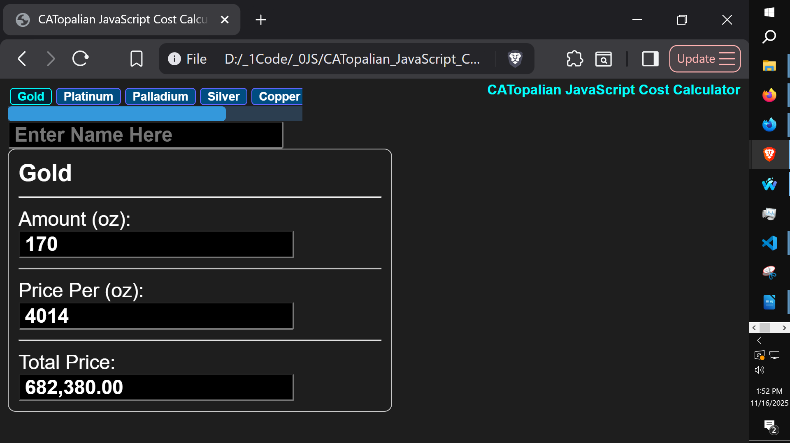
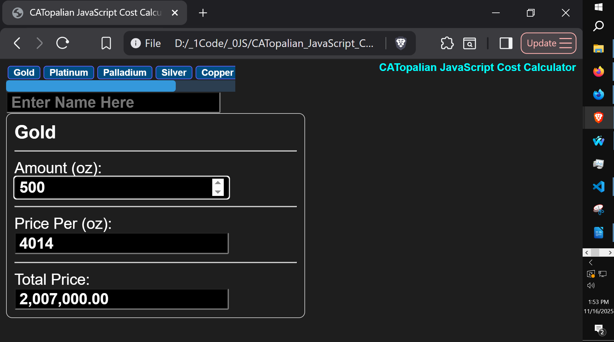
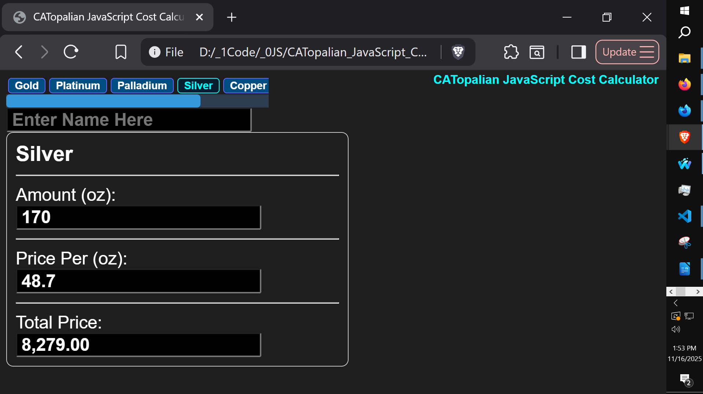
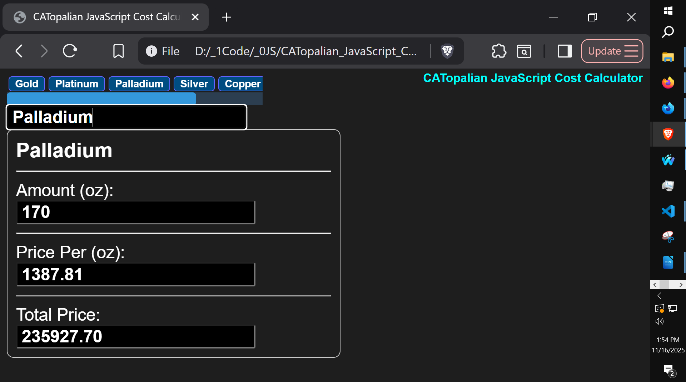
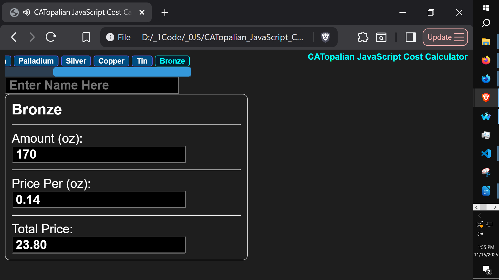
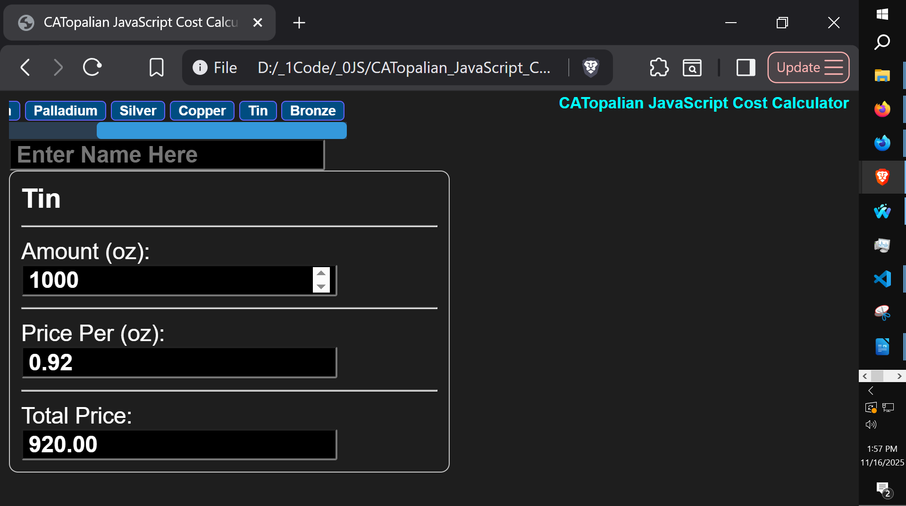
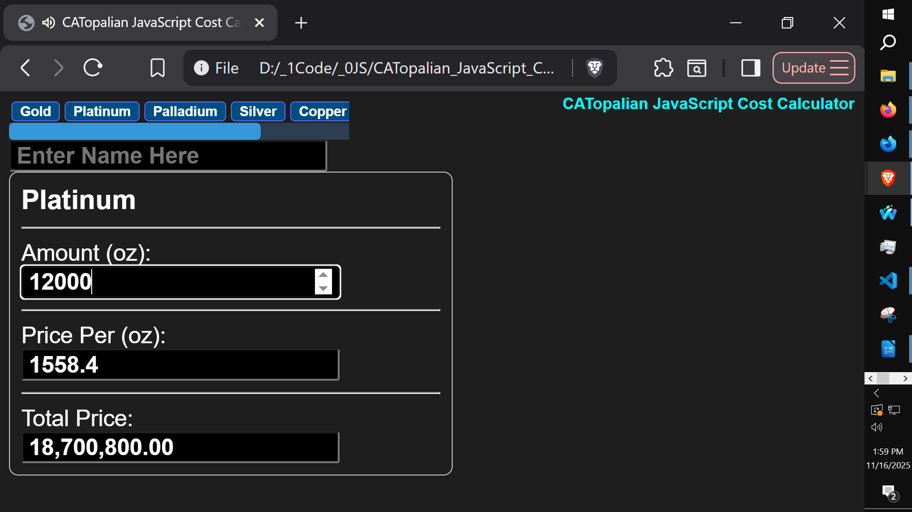

# CATopalian JavaScript Cost Calculator
This JavaScript app will calculate costs based on data in an array of objects. The output price is formatted with a comma for easy readability.

---

Use App: https://christopherandrewtopalian.github.io/CATopalian_JavaScript_Cost_Calculator/CATopalian_JavaScript_Cost_Calculator.html

Video: https://youtu.be/WCeR8oishq8

---

### How to Download this App
1. Click the green Code Button on this github page
2. Choose Download ZIP
3. Save the Zip File
4. Extract All
5. Double click the HTML file to start the App

---

Happy Scripting :-)

---

//----//

// Dedicated to God the Father  
// All Rights Reserved Christopher Andrew Topalian Copyright 2000-2025  
// https://github.com/ChristopherTopalian  
// https://github.com/ChristopherAndrewTopalian  
// https://sites.google.com/view/CollegeOfScripting

